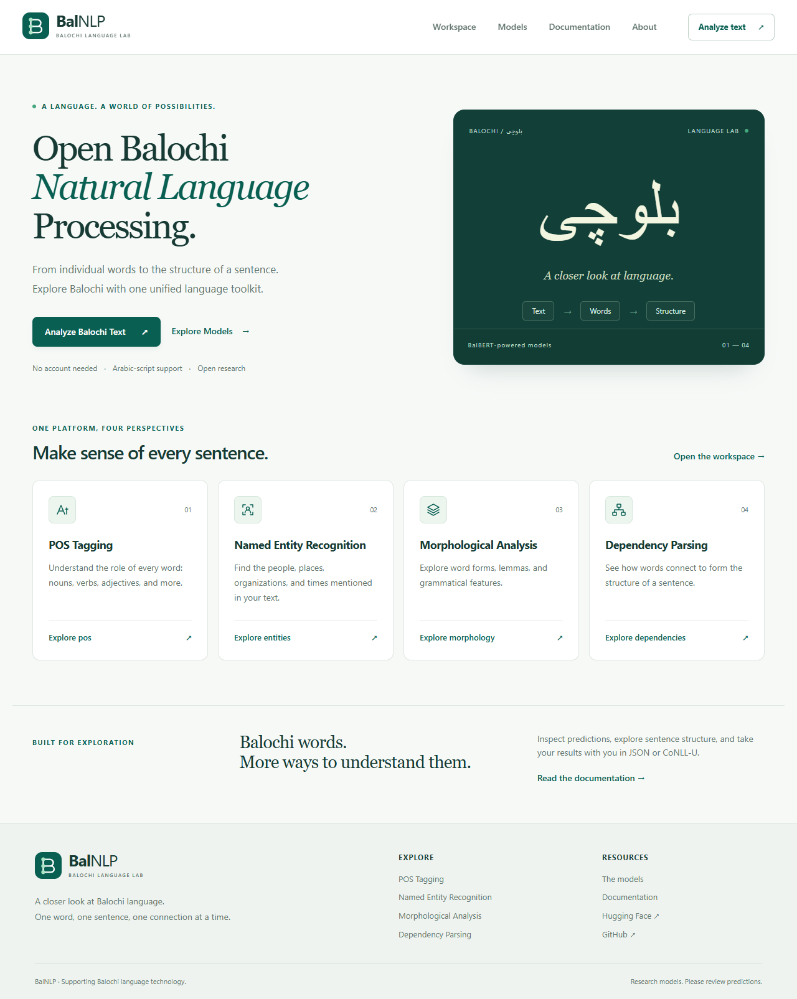

# BalNLP

**Open Balochi Natural Language Processing** — a Python library, FastAPI service, and
Next.js workspace for exploring Arabic-script Balochi text.



## Release status

All four models now run through the unified API. BalMorph uses the recovered author notebook with strict checkpoint loading and exact forward-output verification. Real Balochi inference returns lemmas and morphological features. See [BalMorph verification](docs/balmorph-verification.json) and [source provenance](docs/BALMORPH_SOURCE.md).

The real BalParser checkpoint has passed strict loading and CPU inference, including
tree validation and CoNLL-U export. See [the release checks](docs/RELEASE_CHECKS.md) for
the final verified status of every component. Unit and browser tests use fixtures
only in test files. They do not establish model quality.

**The published checkpoints cannot run within Render Free's 512 MB RAM.** Each is
approximately 1.1 GB of weights. Sequential loading reduces concurrent residency but
does not make one checkpoint fit. No paid GPU is needed; use CPU hardware with enough
RAM, or provide independently validated smaller checkpoints. The free Render config
can boot the API and serve health checks, but is not a working free inference claim.

## Features

- Full or individual POS, NER, morphology interface, and dependency analysis.
- RTL input, word-level tables, POS chips, entity highlighting, SVG dependency trees.
- Copy/download JSON and sentence-aware CoNLL-U; no server-side file storage.
- NFC normalization, preserved Balochi characters, Unicode code-point offsets.
- Lazy loading, low/balanced/performance memory modes, strict custom checkpoint loading.
- One concurrent inference job, bounded bodies, rate limits, timeouts, and partial results.
- No database, accounts, persistent text history, or text logging.

## Architecture

```text
Browser → Next.js (Vercel) → FastAPI (CPU host) → BalNLP core → Hugging Face cache
                                                  │
                            POS → unload → NER → unload → Morph → unload → Parser
```

The sequence is scheduling order, not a claim that separately trained models share
an encoder or consume each other's predictions. The library has no FastAPI imports.
Adapters can later share representations only if their trained architectures permit it.

## Models

| Component | Public repository | Inference implementation |
|---|---|---|
| BalBERT | [shah-bakhsh/BalBERT](https://huggingface.co/shah-bakhsh/BalBERT) | Backbone, not loaded separately |
| BalPOS | [shah-bakhsh/BalPOS](https://huggingface.co/shah-bakhsh/BalPOS) | Token classification |
| BalNER v2 | [shah-bakhsh/BalNER-v2](https://huggingface.co/shah-bakhsh/BalNER-v2) | BIO token classification |
| BalMorph v2 | [shah-bakhsh/BalMorph](https://huggingface.co/shah-bakhsh/BalMorph) | Awaiting original inference source |
| BalParser v2 | [shah-bakhsh/BalParser](https://huggingface.co/shah-bakhsh/BalParser) | Exact author-supplied biaffine architecture |

Official revisions are pinned in `balnlp/config.py`. All IDs and revisions can be
overridden through environment variables; local directory paths also work. The empty
`BalNER` repository is deliberately not selected. No remote Python is trusted or run.
See [model integration details](docs/MODELS.md).

## Install and run locally

Requirements: **Python 3.12**, **Node.js 24**, and sufficient disk/RAM for the selected
checkpoints. Dependencies are pinned, with a frontend lockfile. Commands below start
from the repository root. In Windows PowerShell, use `Copy-Item` in place of `cp`.

```bash
python -m venv .venv
# macOS/Linux:
source .venv/bin/activate
# Windows PowerShell instead:
# .\.venv\Scripts\Activate.ps1

python -m pip install torch==2.14.0 --index-url https://download.pytorch.org/whl/cpu
python -m pip install -e '.[api,inference,dev]'
cp .env.example .env
uvicorn backend.app.main:app --reload --host 127.0.0.1 --port 8000 --no-access-log
```

In a second terminal:

```bash
cd frontend
cp .env.example .env.local
npm ci
npm run dev
```

Open http://localhost:3000. The API serves `/docs`, `/redoc`, and `/api/v1/health` on
port 8000. Health checks do not import PyTorch or load weights. Keep the backend
command at repository root so `.env` is found. Alternatively, install the root
package, change into `backend/`, supply environment variables, and run
`uvicorn app.main:app --reload`.

## Python quick start

```python
from balnlp import BalNLP

nlp = BalNLP.from_pretrained()
try:
    result = nlp.analyze("بلوچی متن")
    print(result.model_dump_json(indent=2))
    print(nlp.to_conllu(result))
finally:
    nlp.close()
```

Also supported: `nlp.pos(text)`, `nlp.ner(text)`, `nlp.morph(text)`, `nlp.parse(text)`
and `nlp.analyze(text, tasks=["pos", "ner", "parser"])`. The result is a Pydantic
model with `model_dump()` for a Python dictionary. Missing predictions remain null.

## API

```bash
curl -X POST http://localhost:8000/api/v1/analyze \
  -H "Content-Type: application/json" \
  -d '{"text":"بلوچی متن"}'
```

| Method | Path | Purpose |
|---|---|---|
| GET | `/api/v1/health` | Lightweight process liveness |
| GET | `/api/v1/models` | Safe configuration status; does not imply readiness |
| POST | `/api/v1/analyze` | All tasks, or a `tasks` list |
| POST | `/api/v1/pos` | POS only |
| POST | `/api/v1/ner` | NER only |
| POST | `/api/v1/morph` | Morphology only, pending integration |
| POST | `/api/v1/parse` | Dependency parsing only |

Partial success is HTTP 200 with `meta.completed_tasks` and `meta.failed_tasks`.
If no requested task succeeds, a consistent error object and appropriate HTTP
status are returned. See [API contracts](docs/API.md).

## Tests and production build

```bash
# Root, Python virtual environment active
ruff check balnlp backend tests scripts
ruff format --check balnlp backend tests scripts
pytest -q -m 'not integration'

# Optional real checkpoints (downloads several GB; CPU inference is sequential)
# PowerShell: $env:BALNLP_RUN_INTEGRATION='1'
BALNLP_RUN_INTEGRATION=1 pytest -v -m integration

cd frontend
npm run lint
npm run typecheck
npm test
npm run build
npx playwright install chromium
npm run test:e2e
npm start
```

The basic CI suite does not download model weights. It installs CPU PyTorch for
small synthetic architecture and decoder tests. Browser tests mock HTTP responses;
real integration tests are separate. GitHub Actions covers both suites and build.

## Docker and deployment

```bash
# Repository root; Docker daemon must be running
cp .env.example .env
docker compose config
docker compose up --build
```

Docker uses an unprivileged user, CPU wheels, one Uvicorn worker, and a shared model
cache volume. The frontend Docker build uses Next.js standalone output. Do not place
the Python backend on Vercel. Follow [Render and Railway deployment steps](docs/DEPLOYMENT.md).

## Memory, privacy, and operational limits

`BALNLP_MEMORY_MODE=low` loads and releases each task immediately. Balanced retains
up to two models with LRU eviction; performance retains up to four. Set those modes
only after measuring the available host memory. Downloads remain in Hugging Face's
cache; unloading weights does not delete the files. RSS release depends on OS and
allocator behavior. Quantization is intentionally not enabled without validation.

The default device is CPU. `BALNLP_DEVICE=auto` uses CUDA if present; `cuda` explicitly
requires it. One inference request runs at once, and busy requests get 503. HTTP
timeouts do not kill PyTorch threads: a timed-out job retains the slot until it ends.
An indefinitely blocked native call requires process restart. There is no unbounded
job queue. Client text is never persisted or logged; hosting-level access logs and
infrastructure behavior remain the operator's responsibility.

## Limitations and roadmap

- Extend author-reviewed linguistic evaluation of the recovered BalMorph adapter.
- Validate smaller or quantized checkpoints before promising 512 MB inference.
- Evaluate tokenization, first-subword POS/NER alignment, dialects, and domain shift.
- Add a broader author-reviewed example set; the shipped input example comes from the brief.
- Review sentence segmentation (punctuation/newlines) against treebank conventions.
- Shared encoder inference is future work, not an assumption about independent checkpoints.
- Dark mode is deferred; functional and accessible light-mode views are implemented.

BalParser's author-reported test results are UAS 54.33%, LAS 45.23%, Macro F1 46.78%,
Weighted F1 71.13%, and Root Accuracy 64.71%. These are not recomputed by the smoke
tests. Other evaluation summaries: **[DATA REQUIRED]** until reviewed for publication.

## Screenshots, citation, license, and contributing

[Desktop](docs/screenshots/home-desktop.png) · [Mobile](docs/screenshots/home-mobile.png)

Citation: **[DATA REQUIRED]** — add the author's publication/DOI when available.
The application license has **not** been selected; see [LICENSE](LICENSE). Model
licenses are independent. Contributions follow [CONTRIBUTING.md](CONTRIBUTING.md).


## Current deployment status

`DEPLOYMENT_READY_RESOURCE_LIMITED` — source and hosting configurations are prepared. GitHub publication was rejected with HTTP 403 (integration Contents write access); no public endpoint has been deployed or verified. Render is primary and Railway is fallback. No paid plan, disk or compute was activated.

BalMorph is enabled by default through `balnlp.morph_adapter:NotebookBalMorph`. All four tasks completed real local API inference. `enable_morph=False` remains available to disable it explicitly. Unknown lemma rules return null rather than guessed lemmas.

A local BalPOS-only probe measured 964 MiB process RSS during inference; see `docs/memory-pos.json`. This exceeds the 512 MB free-host allowance. Low mode unloads each model safely, but does not make a single oversized model fit. The free deployment returns a clear resource error instead of attempting a known oversized load.

